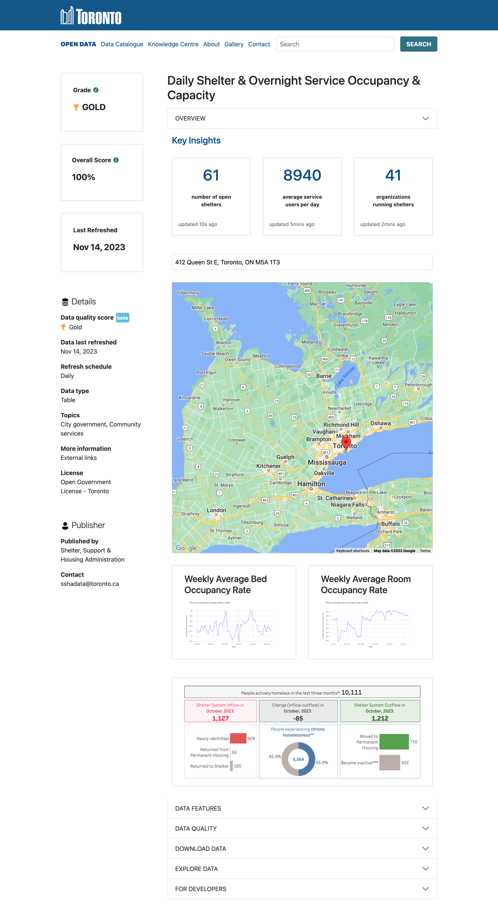

# Open Data Toronto Hackathon Project

## Project Screenshots

## Project Overview
Welcome to the Open Data Toronto Hackathon project! Our goal is to enhance the accessibility and usability of the Open Data Toronto webpage. In this 24-hour hackathon, we've formed three teams: Data Science, Software, and UI/UX. Each team plays a crucial role in making Toronto's open data more accessible and valuable to the general public.

This project was bootstrapped with [Create React App](https://github.com/facebook/create-react-app).

### Collaborators 
#### UI/UX Team
- Alex
- Kristin

#### Software Team
- Leslie
- Kai
- Ami

#### Data Science Team
- Reema
- Apurba

### Project Setup
To get started with the project locally, follow these steps:

### Clone the repository
git clone git@github.com:manyprojects/open-data-toronto.git

### Change into the project directory
cd open-data-toronto 
cd SOFTWARE 
cd client 

### Install dependencies
npm install

### Start the development 
npm start

## Acknowledgments

Special thanks to:

- The Open Data Toronto community for providing valuable datasets.
- All collaborators who have helped improve this project.
